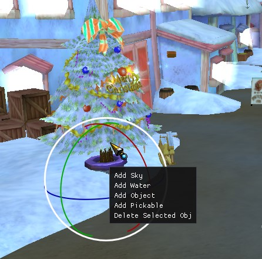
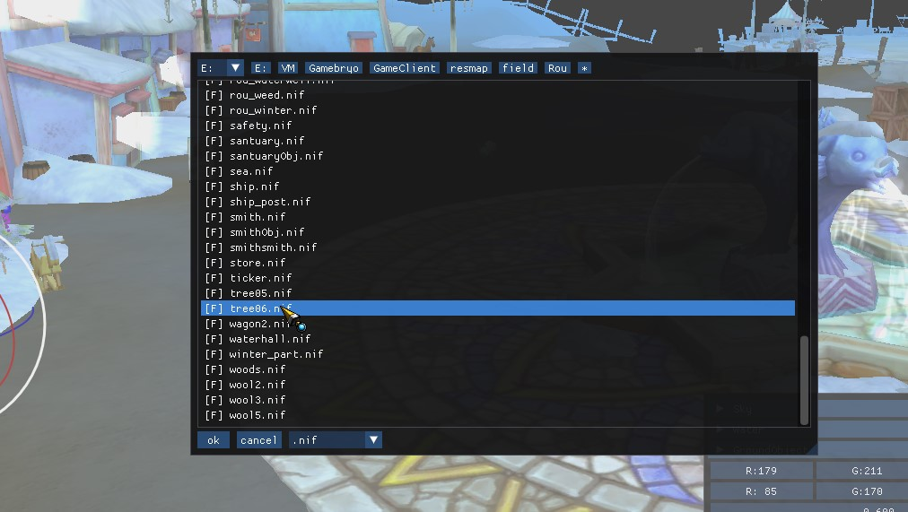

# Fiesta Online Developer Tool

Welcome to the Fiesta Online Developer Tool repository! This tool is designed to aid developers and modders in working with Fiesta Online game files. Please note that this tool is provided "as is" without any warranties or guarantees, and the developer does not claim any copyright over it.

## Features

### SHMD Editor Submodule

- **Map Rendering**: The tool can load .shmd files and render maps based on the Fiesta Online file structure.
- **Visual Settings Editing**: Adjust settings such as Frustum, Light Colors, and Fog Values to customize the visual appearance.
- **Global Sky, Water, and Map Objects Editing**: Modify global elements of the map like the sky, water, and other map objects.
- **Non-Global Objects Editing**: Edit objects that are not globally applied. These objects can be moved and rotated using a gizmo.
- **Save Functionality**: Save the edited .shmd files with the modifications made using the tool.

### SHBD Editor Submodule

- **Loading and Editing SHBD Files**: With the new SHBD Editor submodule, you can now load and edit SHBD files as well.

## Screenshots

### SHMD Editor

1. Middle Mouse Button Menu  
   

2. Folder Dialog  
   

3. Start Screen  
   

4. Translate Gizmo  
   

5. Rotate Gizmo  
   

### SHBD Editor

1. SHBD Editor Tool Part  
   

## Usage

To get started with the Fiesta Online Developer Tool, simply download the latest release from the Releases section of this repository. Once downloaded, run the executable file to launch the tool. You can then load .shmd or .shbd files, make edits, and save your changes as needed.

## License

This tool is provided under an open-source license. Please refer to the LICENSE file in this repository for more information.
