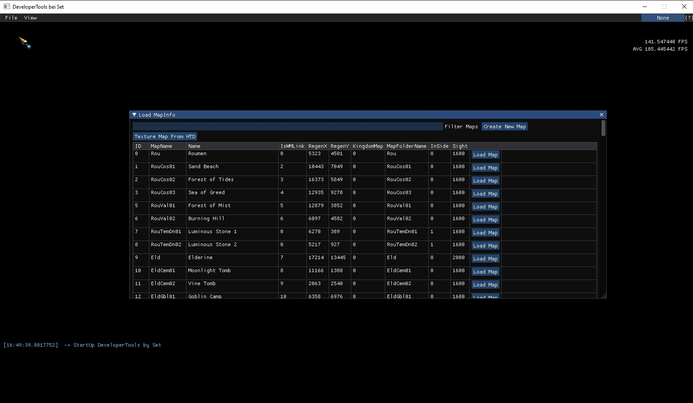
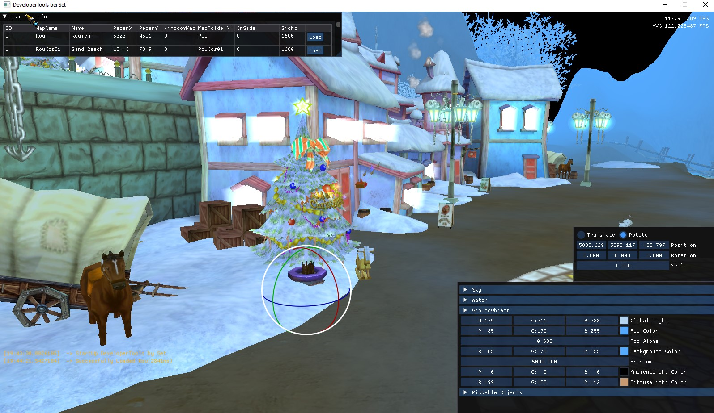
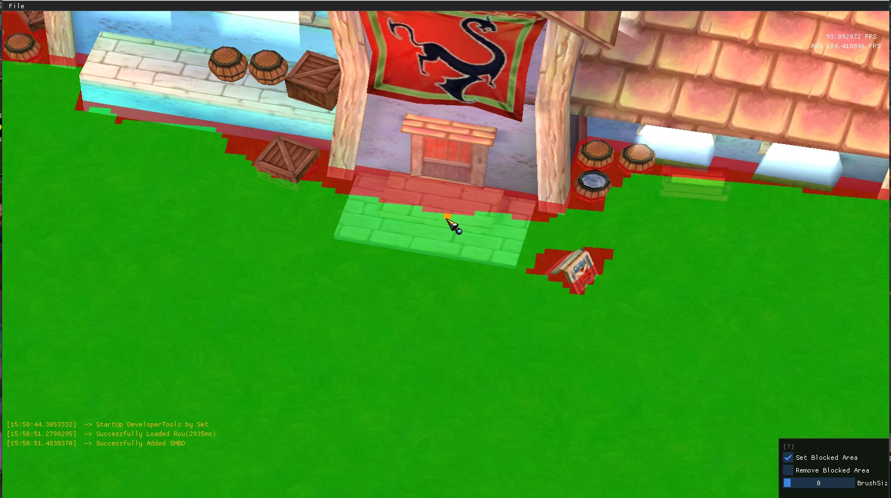

# Fiesta Online Developer Tool
 
Welcome to the Fiesta Online Developer Tool repository! This tool is designed to aid developers and modders in working with Fiesta Online game files. Please note that this tool is provided "as it is" without any warranties or guarantees, and the developer does not claim any copyright over it. It has simply been created out of curiosity on how the Fiesta Online files work and interact with each other. You may use this to learn and understand stuff on your own :)
 
## Disclaimer
 
Please be aware that the Fiesta Online Developer Tool will replace a shader in the original game client. This replacement is necessary because the tool uses a newer version of the Gamebryo engine, which requires some adjustments.
 
As far as testing has shown, this change should not affect the game client's functionality in any way. However, please use the tool at your own risk and ensure you have backups of your original game files before making any modifications.
 
## Developer Builds
 
If you're interested in experimenting with the latest features and improvements, you can access the developer builds by checking out the other branches in this repository. For detailed installation instructions, please refer to the [Install.md](./Install.md) file. These builds are more experimental and may contain unfinished features or bugs, so proceed with caution!
 
## Features
 
### SHMD Editor Submodule
 
- **Map Rendering**: The tool can load .shmd files and render maps based on the Fiesta Online file structure.
- **Visual Settings Editing**: Adjust settings such as Frustum, Light Colors, and Fog Values to customize the visual appearance.
- **Global Sky, Water, and Map Objects Editing**: Modify global elements of the map like the sky, water, and other map objects.
- **Non-Global Objects Editing**: Edit objects that are not globally applied. These objects can be moved and rotated using a gizmo.
- **Save Functionality**: Save the edited .shmd files with the modifications made using the tool.
 
### SHBD Editor Submodule
 
- **Loading and Editing SHBD Files**: With the new SHBD Editor submodule, you can now load and edit SHBD files as well.
 
### HTDG-Editor Submodule
 
- **Heightmap Editing**: Change the heightmap to update the visual of the map using various tools (e.g., levelling, smoothing, texturing). Updates are shown in real-time.
 
### Texture-Editor Submodule
 
- **Texture Editing**: Update textures by drawing directly onto the map with different brushes (smoothing, Perlin, regular color). Updates are shown in real-time.
 
### Map-Creator Submodule
 
- **Map Generation**: Generate new maps using algorithms like Perlin, Worley, or DiamondSquare. Customize parameters to create endless map variations. The generated maps can be instantly edited with all other tools, but need to be added to the .shn files manually. Apply erosion to smooth the entire map and create shadows for the VertexColors.
 
### General Features
 
- **File Selectors**: File selectors that choose a .nif file now preview those files, and the same applies to textures in the .dds format.
- **Scene Overview**: A general scene overview has been added where objects can be selected, and the camera gets teleported there. This feature can be toggled on or off.
- **Updated Graphics**: The tool's graphics have been updated to resemble the actual game more closely.
- **Shortcuts**: A variety of shortcuts have been added for easier use. Check the help window for a full list of shortcuts.
- **New Settings**: Includes options for auto-save timing, full-screen mode, and toggling SHMD objects visibility.
 
## Screenshots
 
### SHMD Editor
 
1. Middle Mouse Button Menu  
 
https://github.com/user-attachments/assets/7eee7437-4e08-4128-87f4-9f2f427d706b
 
 
2. Start Screen  
   
 
3. Translate Gizmo  
   
 
4. Rotate Gizmo  
   
 
### SHBD Editor
 
1. SHBD Editor Tool Part  
   
 
### HTDG-Editor
 
1. Heightmap Editing  

https://github.com/user-attachments/assets/798623bc-5faa-4f25-853e-7b66d69b122c
 
 
### Texture-Editor
 
1. Texture Editing  
 
https://github.com/user-attachments/assets/88eaa050-bef6-4b47-ba06-5489043abe3f
 
 
### Map-Creator
 
1. Map Generation  
   
   
   
 
## Usage
 
To get started with the Fiesta Online Developer Tool, simply download the latest release from the Releases section of this repository. Once downloaded, run the executable file to launch the tool. You can then select your client path and after a restart, the tool will prompt you with an overview of your MapInfo.shn.
 
## License
 
This tool is provided under the MIT License.
 
## Acknowledgements
 
At this point, I want to shout out Maki for helping me a lot with understanding the fundamentals and providing me with some coding help for various parts of the project. I also want to shout out to Spiike for doing a lot of alpha testing.
 
A big thank you to everyone else who contributed to developing and improving the tool. Your suggestions, bug reports, and testing have been invaluable. All feedback is welcome and greatly appreciated.
 
---
 
*Note: Some parts of this README were generated with a little help from an AI assistant.*
